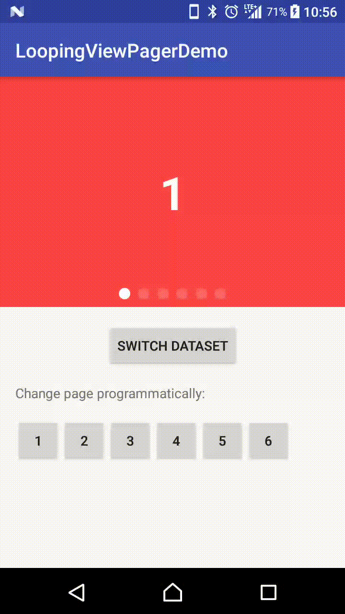

# LoopingViewPager

A ViewPager and a PagerAdapter that can:

1. AutoScroll (On/Off able)
2. Infinite Loop (On/Off able)
3. ViewPager's height can be wrap_content / an aspect ratio
4. Adjustable auto scroll interval
5. Won't scroll nor loop if there is only 1 item
6. Works well with notifyDataSetChanged()
7. Supports page indicators
8. Supports different view types
9. **(New! 1.2.0)** Support peeking adjacent items (But first and last item will appear only after scroll state is idle)

## Demo Effect

<p>



</p>

## Why this library

Although there are already quite a number of similar libraries out there,  
I cannot find one that fits all of the below requirements:  

1. Sufficient documentation
2. Last updated in less than 3 years
3. Good infinite looping effect 
4. Configurable auto-scroll
5. ViewPager that supports fixed aspect ratio
6. Good support with Page Indicators

Especially for 6, even some of them supports, they provide built-in indicators only; or does not tell user how to implement their own indicator.  
I wrote this library to tackle all of these problems I faced after trying a whole day with other libraries.

## Usage

### Add to Project

First make sure `jcenter()` is included as a repository in your **project**'s build.gradle:  

```groovy
allprojects {
    repositories {
        jcenter()
    }
}
```

And then add the below to your app's build.gradle:  

```groovy
    implementation 'com.asksira.android:loopingviewpager:1.3.1'
```

### Step 1: Create LoopingViewPager in XML

```xml
    <com.asksira.loopingviewpager.LoopingViewPager
        android:id="@+id/viewpager"
        android:layout_width="match_parent"
        android:layout_height="wrap_content"
        app:isInfinite="true"
        app:autoScroll="true"
        app:scrollInterval="5000"
        android:clipToPadding="false"
        app:viewpagerAspectRatio="1.78"
        app:itemAspectRatio="1.33"/>
```

| Attribute Name           | Default | Allowed Values                |
|:-------------------------|:--------|:------------------------------|
| isInfinite               | false   | true / false                  |
| autoScroll               | false   | true / false                  |
| viewpagerAspectRatio     | 0       | any float (width / height)    |
| wrap_content(deprecated) | true    | true / false                  |
| scrollInterval           | 5000    | any integer (represents ms)   | 
| itemAspectRatio          | 0       | any float (width / height)    |

viewpagerAspectRatio 0 means does not apply aspectRatio.  
That means, default LoopingViewPager has no aspect ratio and wrap_content is true.  
Once aspect ratio is set, wrap_content will be overridden (meaningless).

In most cases, you should set an aspect ratio.  

`itemAspectRatio` is the aspectRatio of the the item. So, if itemAspectRatio is higher than viewpagerAspectRatio, you can use `clipToPadding="false"` to create a peek item effect.  
You can refer to [#17](https://github.com/siralam/LoopingViewPager/issues/17).

If you wonder why you need to set `app:wrap_content="true"`, take a look at [this Stackoverflow post](https://stackoverflow.com/questions/8394681/android-i-am-unable-to-have-viewpager-wrap-content).

**wrap_content is deprecated in v1.1.3**. It is still available but I think there can be unknown problems. I am not going to debug issues related to setting wrap_content to true as well.

### Step 2: Create your PagerAdapter that extends LoopingPagerAdapter

You should
1. Specify the data type in the generic (`<DataType>`)
2. Create your own constructor according to this `DataType`
3. override `inflateView()` and `bindView()`
4. DO NOT override getCount(). Look at `LoopingPagerAdapter`. getCount() has special implementation.

```kotlin
class DemoInfiniteAdapter(
    context: Context,
    itemList: ArrayList<YourObject>,
    isInfinite: Boolean
) : LoopingPagerAdapter<YourObject>(context, itemList, isInfinite) {

    //This method will be triggered if the item View has not been inflated before.
    override fun inflateView(
        viewType: Int,
        container: ViewGroup,
        listPosition: Int
    ): View {
        return LayoutInflater.from(context).inflate(R.layout.item_pager, container, false)
    }

    //Bind your data with your item View here.
    //Below is just an example in the demo app.
    //You can assume convertView will not be null here.
    //You may also consider using a ViewHolder pattern.
    override fun bindView(
        convertView: View,
        listPosition: Int,
        viewType: Int
    ) {
        convertView.findViewById<View>(R.id.image).setBackgroundColor(context.resources.getColor(getBackgroundColor(listPosition)))
        val description = convertView.findViewById<TextView>(R.id.description)
        description.text = itemList?.get(listPosition).toString()
    }
}
```

### Step 3: Bind LoopingViewPager with your Adapter

```kotlin
        adapter = DemoInfiniteAdapter(context, dataItems, true)
        loopingViewPager.setAdapter(adapter)
```

### Step 4: Resume and Pause autoScroll in your Activity (If you need autoScroll)

```kotlin
    override fun onResume() {
        super.onResume()
        loopingViewPager.resumeAutoScroll()
    }

    override fun onPause() {
        loopingViewPager.pauseAutoScroll()
        super.onPause()
    }
```

### Handling dataSet change

If you have new data to update to your adapter, simply call:

```kotlin
adapter.setItemList(newItemList)
viewPager.reset() //In order to reset the current page position
```

## How do I implement different View types?

Simple! Override one more method in your Adapter:

```kotlin
    override fun getItemViewType(listPosition: Int): Int {
        return if (itemList?.get(listPosition) == 0) VIEW_TYPE_SPECIAL else VIEW_TYPE_NORMAL
    }
```

And then, of course, according to the `viewtype` parameter passed to you in `inflateView()` and `bindView()`, differentiate what you need to inflate or bind.

You may also refer to the demo app for a complete example.

## How do I integrate a Page Indicator?

I don't officially provide a built-in page indicator because:
1. ViewPager and Indicator are logically separated
2. I want to make this library adaptable to all page indicators

With that said, I have created a simple `CustomShapePagerIndicator` included in this library.  
It is simple but very flexible, because you need to / you can provide your own implementation of how to inflate the unselected and selected indicators.

I assume for any indicator libraries you use, they should provide a method for you to call so that you can simply redirect `onPageScrolled(position: Int, positionOffset: Float, positionOffsetPixels: Int)` of `ViewPager.OnPageChangeListener` to the indicator library,  
And then the indicator library will then be able to handle the transitions for you, which is also the case in `CustomShapePagerIndicator`.

So, the job of `LoopingViewPager` is simply to mask the infinite behavior into a `onPageScrolled` behavior which looks like it is not infinite.  
In other words, when you scroll from last page to first page, it will be converted to directing jumping from last page back to first page;  
When you scroll from first page backward to last page, it will be converted to directing jumping from first page to last page.  
If you do not accept this assumption, I am sorry but you probably need to find something else.

So, instead of adding another `onPageChangeListener`, you simply do this:  
(Below example is using built in `CustomShapePagerIndicator`)

```kotlin
loopingViewPager.onIndicatorProgress = { selectingPosition, progress -> 
    indicatorView.onPageScrolled(selectingPosition, progress)
}
```

Note that this is a brand new implementation of how `LoopingViewPager` in v1.3.0, after I realized how wrong I was 2 years ago.  
If you need to stick with the old implementation, please use v1.2.0 and checkout the README.md at the commit before this version.

### If you want to use CustomShapePagerIndicator, here is how

(You can always refer to the demo app.)

First, add `CustomShapePagerIndicator` to your XML, use wrap_content for width and height,  
And specify the spacing between unselected indicators (`app:indicator_spacing="?dp"`):

```xml
    <com.asksira.android.customshapepagerindicator.CustomShapePagerIndicator
        android:id="@+id/indicator"
        android:layout_width="wrap_content"
        android:layout_height="wrap_content"
        app:layout_constraintBottom_toBottomOf="@id/viewpager"
        app:layout_constraintLeft_toLeftOf="parent"
        app:layout_constraintRight_toRightOf="parent"
        android:layout_marginBottom="8dp"
        app:indicator_spacing="4dp"/>
```

Then, tell the indicator how to inflate your unselected of highlighter indicators:
```kotlin
        customShapePagerIndicator.highlighterViewDelegate = {
            val highlighter = View(this)
            highlighter.layoutParams = FrameLayout.LayoutParams(16.dp(), 2.dp())
            highlighter.setBackgroundColor(getColorCompat(R.color.white))
            highlighter
        }
        customShapePagerIndicator.unselectedViewDelegate = {
            val unselected = View(this)
            unselected.layoutParams = LinearLayout.LayoutParams(16.dp(), 2.dp())
            unselected.setBackgroundColor(getColorCompat(R.color.white))
            unselected.alpha = 0.4f
            unselected
        }
```

Note that you must provide a fixed width and height for your indicators.  
Because `CustomShapePagerIndicator` use margins internally to handle indicator spacing, please do not specify your own margin when providing your own views.

Finally, for the first time and whenever you need to update your indicator counts:

```kotlin
customShapePagerIndicator.updateIndicatorCounts(loopingViewPager.indicatorCount)
```

## Release notes

v1.3.2
- Fixed crash due to getChildAt() returns null

v1.3.1
- Converted everything to Kotlin
- Revamp the whole logic of pager indicator handling
- Added built-in `CustomShapePagerIndicator`

v.1.2.0
- Added requirement mentioned in #17.

v1.1.4
- Merged #11.

v1.1.3
- Merged #15 which includes AndroidX support and `resetAutoScroll()` which is equivalent to `pauseAutoScroll()` and then `resumeAutoScroll()`.

v1.1.2
- Added `ViewGroup container` as an argument to `inflateView()`. You should now use it as the parent of when you inflate your view.  
- Updated gradle version and support library version.

v1.1.0
- Added support for view type. But therefore changed parameters needed in `inflateView()` and `bindView()`.

v1.0.5
- Added asepct ratio attribute for `LoopingViewPager`  
- Rewrote the way of caching Views in `LoopingPagerAdapter`, and therefore separated inflation and data binding  
- Rewrote the way of implementing ViewPager wrap_content

v1.0.4
- Indicator now works with page skipping as well (By calling `selectCurrentItem()`)
- Leviated indicator fluctuating phenomenon when using `onIndicatorProgress()` callback
- Added option for smart or non-smart indicators


v1.0.1  
- Fixed a bug where getSelectingIndicatorPosition() is returning incorrect value.
- Updated README.md according to PageIndicatorView v1.0.0 update.

## License

```
Copyright 2017 Sira Lam

Permission is hereby granted, free of charge, to any person obtaining a copy of this software and 
associated documentation files (the LoopingViewPager), to deal in the Software without restriction,
including without limitation the rights to use, copy, modify, merge, publish, distribute, sublicense,
and/or sell copies of the Software, and to permit persons to whom the Software is furnished to do so,
subject to the following conditions:

The above copyright notice and this permission notice shall be included in all copies or 
substantial portions of the Software.

THE SOFTWARE IS PROVIDED "AS IS", WITHOUT WARRANTY OF ANY KIND, EXPRESS OR IMPLIED,
INCLUDING BUT NOT LIMITED TO THE WARRANTIES OF MERCHANTABILITY, FITNESS FOR A PARTICULAR PURPOSE
AND NONINFRINGEMENT. IN NO EVENT SHALL THE AUTHORS OR COPYRIGHT HOLDERS BE LIABLE FOR ANY CLAIM,
DAMAGES OR OTHER LIABILITY, WHETHER IN AN ACTION OF CONTRACT, TORT OR OTHERWISE, ARISING FROM,
OUT OF OR IN CONNECTION WITH THE SOFTWARE OR THE USE OR OTHER DEALINGS IN THE SOFTWARE.
```